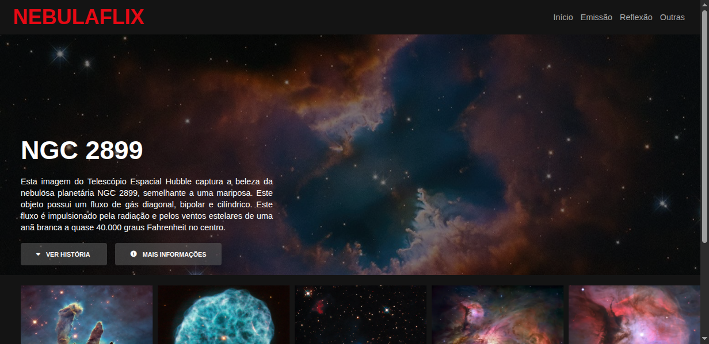

# Nebulaflix 🌌

  

## 📖 Sobre o Projeto

Este projeto é um clone da página inicial da Netflix, desenvolvido como parte de um desafio de codificação. Para dar um toque pessoal e criativo, o tema foi adaptado para "Nebulaflix", uma plataforma focada em exibir a beleza de nebulosas e outros objetos astronômicos, um tema inspirado no meu Trabalho de Conclusão de Curso (TCC).

O objetivo foi praticar e demonstrar habilidades em desenvolvimento front-end, recriando uma interface conhecida com um novo conceito.

---

## 🛠️ Tecnologias Utilizadas

As seguintes tecnologias foram usadas na construção do projeto:

* **HTML5:** Para a estrutura e semântica do conteúdo.
* **CSS3:** Para estilização, layout (Flexbox) e responsividade.
* **JavaScript:** Para a funcionalidade do carrossel de imagens.
* **Owl Carousel:** Biblioteca JS para criar o carrossel de forma simples e eficaz.
* **Font Awesome:** Para os ícones dos botões.

---

## ✨ Funcionalidades

* Layout inspirado na interface da Netflix.
* Seção de destaque com informações sobre uma nebulosa principal.
* Carrossel interativo para navegar por diferentes nebulosas.
* Design responsivo (adaptação para diferentes tamanhos de tela).

---

## 🚀 Como Executar o Projeto

Para visualizar o projeto, basta clonar este repositório e abrir o arquivo `index.html` no seu navegador de preferência.

```bash
# Clone o repositório
git clone https://github.com/vanbustamante/fullstack-developer-DIO.git

# Acesse a pasta do projeto (exemplo)
cd fullstack-developer-DIO/proj-netflix

# Abra o index.html no navegador
```

## 👨‍💻 Autora:
Desenvolvido por Vanessa Osório Bustamante.

<a href="https://www.linkedin.com/in/vanessaosoriobustamante/" target="_blank">
    
</a>